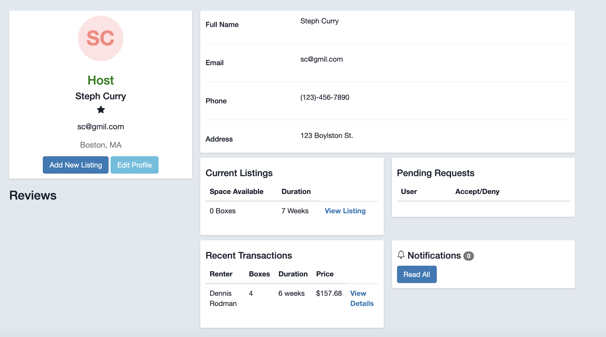
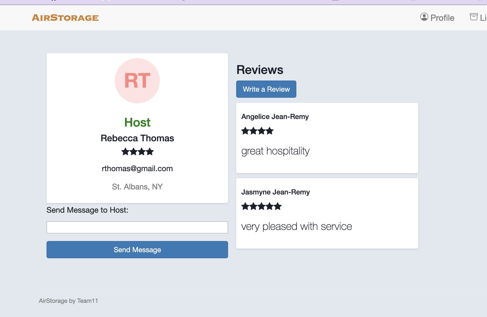
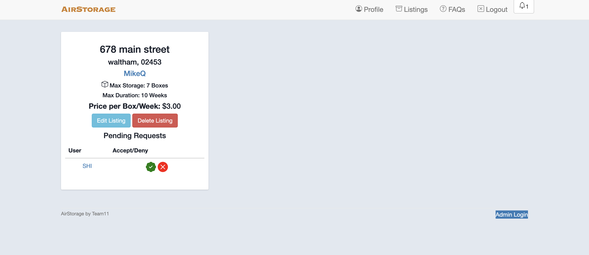
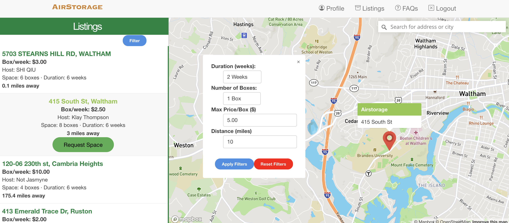

<!-- PROJECT LOGO -->

  
  <h1 align="center">Team 11: AirStorage</h1>
  

    COSI 166b Term Project
     
    <a href="https://airstorage.herokuapp.com/">Heroku Deployment</a>
     
    <a href="https://github.com/Mikeq0621/COSI166_team11">Github Repository</a>
     
    <a href="https://mikeq0621.github.io/COSI166_team11/">Github Page</a>
  

<!-- TABLE OF CONTENTS -->

  
Table of Contents

  <ol>
    <li>
      <a href="#about-airstorage">About AirStorage</a>
    </li>
    <li>
      <a href="#dependencies">Dependencies</a>
      <ul>
        <li><a href="#gems-apis-and-libraries">Gems, APIs, and Libraries</a></li>
      </ul>
    </li>
    <li><a href="#navigating-airstorage">Navigating AirStorage</a></li>
    <ul>
        <li><a href="#profile">Profile</a></li>
        <li><a href="#map-listings">Map Listings</a></li>
      </ul>
    <li><a href="#database-schema">Database Schema</a></li>
    <li><a href="#development-and-testing">Development and Testing</a></li>
    <li><a href="#team-member">Team members</a></li>
  </ol>

<!-- ABOUT AIRSTORAGE -->
# About AirStorage: 

AirStorage is an user-driven online marketplace for storage space rental services. Members of the website are divided into Users and Hosts. Users can 
find listings for places offering storage space for their belongings and Hosts can rent out any extra space in their residences for a certain time period with price of their choice.

Basic Functionalities:
* Create an account or log in as either a User or a Host
* Both Users and Hosts can edit their profile
* Users can search for listings and filter their results based on location, storage space size, and duration
* Users can choose a rental space from a map containing nearby options
* Users can apply to a host for an available rental option
* Users can leave a review for a host
* Hosts can post their storage space(s) 
* Hosts will get a email notification when some user request a rental option
* Hosts can choose to accept or deny a request from user
* Hosts can edit information about listed spaces

<!-- DEPENDENCIES -->
# Dependencies: 
* [Ruby 2.7.2](https://www.ruby-lang.org/en/downloads/)
* [Rails 6.1.3](https://rubyonrails.org)
* [Bootstrap 5.0.0](https://getbootstrap.com)

### Gems, APIs, and Libraries:
    MapBox
    Noticed
    Activerecord-import
    Json
    Better_errors
    Pry-rails
    Bcrypt
    Geocoder

For detailed information about interesting gems in this application, please check:
[More about Gems](./docs/OTHER_GEMS.md) 

<!-- NAVIGATING AIRSTORAGE -->
# Navigating AirStorage

We implemented two parallel systems for users and hosts. Signing in as a user or a host would provide you different functionalities. Any user or host can use the links in navigation bar to redirect through the application. 

### Profile

A user or host profile are fairly similar. A user can see pending requests (that is requests for space that have not beeen accepted/denied)and previous transactions, as well as edit their profile. A host profile can do all those things, with the addition of being able to add/view listings, and the ability to accept or deny requests. Below is an image of what an average Host Profile page would look like.

If signed in as user, you can view all existing rental options by clicking _Listings_ in navigation bar. You will be redirected to a map displaying all available rental options nearby. You can also filter the search results with multiple cretirions. You can choose to apply for some rental options that suit you the best. As a user, you have the option to leave your host a review upon a successful transaction.

 

If signed in as a host, you can review the detailed information about your listed spaces, as well as any request to rent this space. You can also decided to accept or deny the request. Once a user request your listed spaces, you will get a email notification as a reminder.

 

Some other general functionalities includes editing the personal information in profile and resetting the password.

### Map Listings

The Map API allows the user to search and browse through available listings based on their preferences. This functionality consists of 4 main features:

* Listings catalog on the left, sorted by proximity. When item is clicked, the map on the right flies to the approppiate and gives user option to request space.
* Interactive map on the right on screen, available listings are red markers, which when clicked on take you to the listing on the Listings catalog.
* Filter button allows the user to filter listings by available space, duration, price, and distance.
* Search bar on the top right of the map, allows the user to search for a specific address/city and re-sorts listings accordingly. 

You can clearly see all 4 features on the image below.

 

[More about Mapping](./docs/LISTINGS.md) 
<!-- DATABASE SCHEMA -->
# Database Schema

<b> Major models </b>

    Host
    Contains Host objects and personal informations, such as email, name, phone number, address and so on.

    Users 
    Contains User objects and personal informations, such as email, name, phone number, address and so on.

    Transactions
    Transaction -> User (is One to Many)
    Transaction -> Host (is One to Many)
    Contains a listing_id, user_id and host_id. It represents a successful connection between a host's rental option to a user's request.

    Listings
    Listing -> Host (is One to Many)
    Contains a host_id, price, durations and etc. It represents a rental space option offered by a host.

    Requests
    Request contains a listing_id, a host_id and a user_id. It represents a record of one user applying a rental option to a host.
  
<b> Other models </b>

    Reviews, Notifications, Admins

<!-- DEVELOPMENT and TESTING-->
# Development and testing

## Development
  We devided and developed our application from pieces of small functionalities, such as sign-in/sign-up system, creating rental option listings, displaying rental option on map, transaction system with user requests, search filters in map results and etc. For each functionality, we developed on a branch and merged to master after testing it fully functional. We also collaborated on some more diffcult functionalities, such as filters and interactive maps.

  The most challenging part would be the map functionalities and search filters.
  
  * Map function

    In the first approach, we failed to implement map search function with Google Map API. Switching from Google Map API to Mapbox Gems, we managed to display all nearby rental options on the map with a pin icon. Upon clicking some individual listing, the map would zoom in to that location and centralize that pin for users.
  
  * Search filter

    In early stages, our search filter can only search on one single field, such as box size and duration time. In the final deployment, we incorperated the search filter into the map. Furthermore, the search filter can now apply to multiple search critirions. User can perform a more specific search on multiple critions.
  
  The application has the automatic deployment to Heroku with github master branch updates.

  For more details discussion, please check:
  [Challenges and accomplishments](./docs/CHALLENGES_ACCOMPLIMENTS.md)

## Testing
  We implemented some mini-tests for each function controller and models. We tested validation for user and hosts model, the proper functions of mailer notification. We also incorporated integration test for general user/host sign-in, and authorized functionalities, such as viewing the listings and creating transactions after sign-in.

## Improvements

* Improve on duration time of rental options

  In current version, we simply used the duration weeks for any rental options. In further developments, we are planning the change the durtation into beginning data and ending data. And add some functionality to close the transaction once it reaches the endding time. In current version, it relies on the host to maually edit their rental options to update on a finished transaction, which is not ideal in for a real application.

* More Ajax implementation

  We are also look forward to implement in-line editing for user/host profile editing and host's rental option editing. So far we failed to implement those editing with Ajax, but just used another form to update related fields.

For detailed further improvments, please check:
[More improvements](./docs/IMPROVEMENTS.md) 

<!-- TEAM-MEMBERs -->
# Team members
* Jasmyne Jean-Remy Email: jasmynej14@brandeis.edu
* Federico Berlfein Email: berlfeinf@brandeis.edu
* Aichuk Tripura Email: aichuktripura@brandeis.edu
* Shi Qiu Email: mikeq@brandeis.edu
