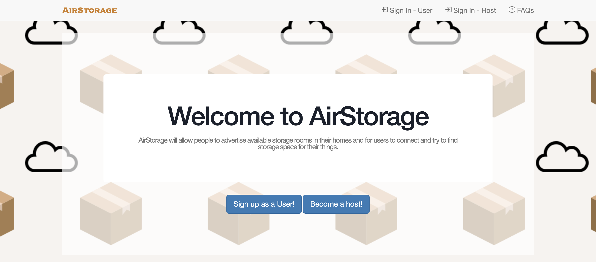
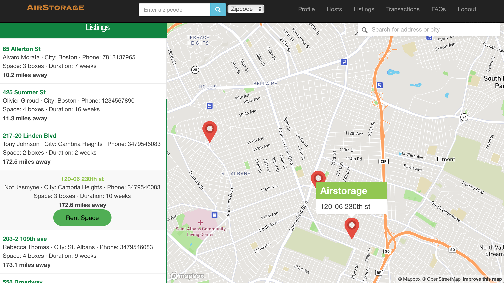
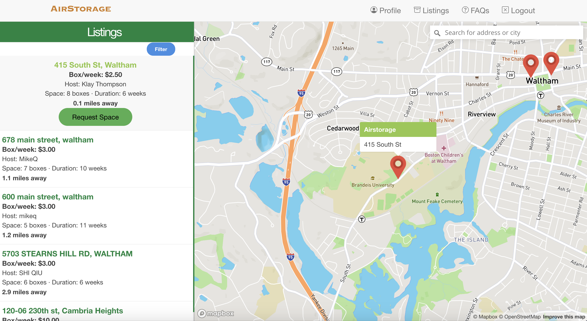

<!-- PROJECT LOGO -->

  
  <h1 align="center">Team 11: AirStorage</h1>
  

    COSI 166b Term Project
     
    <a href="https://airstorage.herokuapp.com/">Heroku Deployment</a>
     
    <a href="https://github.com/Mikeq0621/COSI166_team11">Github Repository</a>
     
  

<!-- TABLE OF CONTENTS -->

  
Table of Contents

  <ol>
    <li>
      <a href="#about-airstorage">About AirStorage</a>
    </li>
    <li>
      <a href="#dependencies">Dependencies</a>
      <ul>
        <li><a href="#gems-apis-and-libraries">Gems, APIs, and Libraries</a></li>
      </ul>
    </li>
    <li><a href="#navigating-airstorage">Navigating AirStorage</a></li>
    <ul>
        <li><a href="#map-listings">Map Listings</a></li>
      </ul>
    <li><a href="#database-schema">Database Schema</a></li>
    <li><a href="#url-paths">Url Paths</a></li>
    <li><a href="#deliverables">Deliverables</a></li>
  </ol>

<!-- ABOUT AIRSTORAGE -->
# About AirStorage: 

AirStorage is an user-driven online marketplace for storage space rental services. Members of the website are divided into Users and Hosts. Users can 
find listings for places offering storage space for their belongings and Hosts can rent out any extra space in their residences for a certain time period with price of their choice.

Basic Functionalities:
* Create an account or log in as either a User or a Host
* Both Users and Hosts can edit their profile
* Users can search for listings and filter their results based on location, storage space size, and duration
* Users can choose a rental space from a map containing nearby options
* Users can apply to a host for an available rental option
* Hosts can post their storage space(s) 
* Hosts will get a email notification when some user request a rental option
* Hosts can choose to accept or deny a request from user
* Hosts can edit information about listed spaces

<!-- DEPENDENCIES -->
# Dependencies: 
* [Ruby 2.7.2](https://www.ruby-lang.org/en/downloads/)
* [Rails 6.1.3](https://rubyonrails.org)
* [Bootstrap 3.4.1](https://getbootstrap.com)

### Gems, APIs, and Libraries:
    MapBox
    Noticed
    Activerecord-import
    Json
    Better_errors
    Pry-rails
    Bcrypt
    Geocoder

[More about Gems](./docs/OTHER_GEMS.md) 
_TODO: Add more about gems_

<!-- NAVIGATING AIRSTORAGE -->
## Navigating AirStorage

At this moment, we have implemented many of the pages we intend to use in the final release of AirStorage. Prototypes for modifications and additions
to the views can be found in the "UI_Prototypes" folder in our github repository. Instructions for navigating through the site can also be found in the FAQs section. 

Clicking the website link brings the visitor to the home page, where there is an option to sign up as either an User or Host. If they already have an account,
they can log in using the option on the header, which also contains the search bar and filter, and links to the member's account, listings, host
list, FAQ and log out upon a succesful log in. Upon logging in or signing up, the member is brought the home page, which then contains the option to find places 
to rent for Users and the option to rent space out for Hosts.  

The members' profile pages contains their personal details and records for recent transactions and pending requests. The Hosts' profile pages also shows
their list of listings that they are offering. 

 

Users can find listings being offered by hosts using the search bar or by clicking the Listings link. Both options brings the User to the interactive map, with the 
latter option showing all listings. The storage spaces being offered are represented using pins and clicking on a pin brings up a relevant renting option. If the 
User selects that, it brings them to another page to confirm their renting, upon which the rent request is added to the User's and Host's pending requests.

### Map Listings

The Map API allows the user to search and browse through available listings based on their preferences. This functionality consists of 4 main features:

* Listings catalog on the left, sorted by proximity. When item is clicked, the map on the right flies to the approppiate and gives user option to request space.
* Interactive map on the right on screen, available listings are red markers, which when clicked on take you to the listing on the Listings catalog.
* Filter button allows the user to filter listings by available space, duration, price, and distance.
* Search bar on the top right of the map, allows the user to search for a specific address/city and re-sorts listings accordingly. 

You can clearly see all 4 features on the image below.

 

<!-- DATABASE SCHEMA -->
## Database Schema

<b> Tables </b>
    
    Name: Hosts 
    Columns: integer id, string name, string email, string password_digest, string phone_number, string address, 
    string city, text zip_code, datetime created_at, datetime updated_at, decimal longitude, decimal latitude, 
    string state

    Name: Users 
    Columns: integer id, string name, string email, string password_digest, string phone_number, datetime created_at,
    datetime updated at, decimal longitude, decimal latitude, string state, string city, string address,
    text zipcode

    Name: Transactions
    Columns: integer id, integer host_id, integer user_id, float price, integer duration, datetime created_at,
    datetime updated_at, integer listing_id

    Name: Listings
    Columns: integer id, integer host_id, integer space, integer available_duration, datetime created_at,
    datetime updated_at
    
    Name: Requests
    Columns: integer id, bigint host_id, bigint listing_id, bigint user_id, available_duration,
    datetime created_at, datetime updated_at, index index_requests_on_host_id, index index_requests_on_listings_id,
    index index_requests_on_user_id
    
    Name: Reviews
    Columns: integer id, bigint user_id,bigint host_id,integer stars,string comment,datetime created_at, datetime updated_at, index ["host_id"] index_reviews_on_host_id, index ["user_id"] index_reviews_on_user_id
    
    Name: Notifications
    Columns: string recipient_type, bigint recipient_id, string type, jsonb params, datetime read_at,datetime created_at, datetime updated_at,index ["read_at"] name: "index_notifications_on_read_at",index ["recipient_type", "recipient_id"], name: "index_notifications_on_recipient"
    
    Associations:
    Hosts -> Listings (One to Many)
    Hosts -> Notifications (One to Many)
    Hosts -> Reviews (One to Many)
    Hosts -> Requests (One to Many)
    Listing -> Requests (One to Many)
    Hosts -> Transactions is (One to Many)
    Users -> Transactions is (One to Many)
    Users -> Requests (One to Many)

<!-- URL PATHS-->
## URL Paths
<b>Home page:</b> /  
<b>Users urls:</b> /users, /users/new, /users/create, /users/delete, /users/:id  
<b>Hosts urls:</b> /hosts, /hosts/new, /hosts/create, /hosts/delete, /hosts/:id  
<b>Login as user:</b> /userlogin  
<b>Login as host:</b> /hostlogin  
<b>Display user profile:</b> /userprofile  
<b>Display host profile:</b> /hostprofile  
<b>Listings url:</b> /listings, /listings/new, /listings/create, /listings/delete, /listings/:id  
<b>Transactions url:</b> /transactions, /transactions/new, /transactions/create, /transactions/delete  
<b>Requests url:</b>   
create a request -> /rent/:listing_id,  
accept a request -> /accept/:req_id,  
decline a request -> /deny/:req_id	   
<b>Search form:</b> /search  
<b>Display search results by different filters:</b>  
/search?search=3&search_filter=box,  
/search?search=3&search_filter=city,   
/search?search=3&search_filter=duration,  
/search?search=3&search_filter=location  
<b>FAQ page:</b> /static_page/faq  
<b>Logout:</b> /logout  

<!-- DELIVERABLES-->
## Deliverables
* Final Delieverables are in the folder marked "final deliverables"
* Tests in test/models and test/integration
